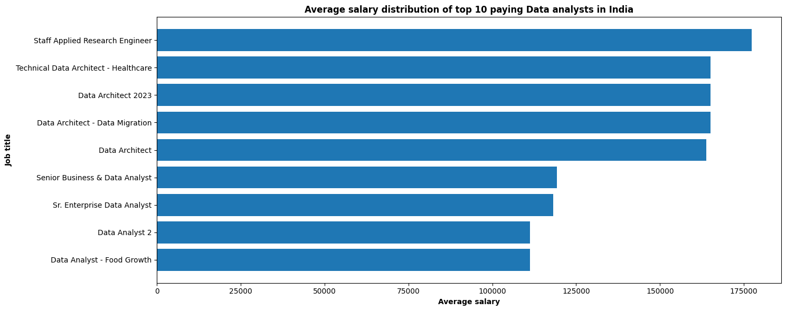
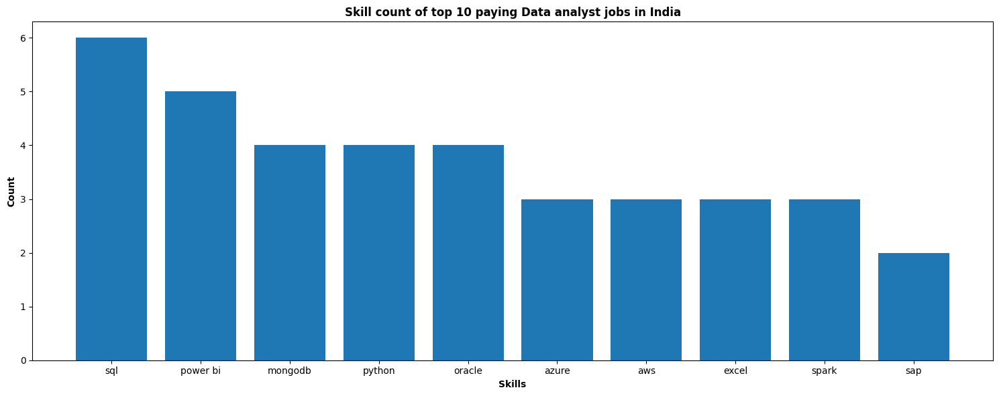

# Introduction
📊 Dive into the data job market! Focusing on data analyst roles, this project explores 💰 top-paying jobs, 🔥 in-demand skills, and 📈 where high demand meets high salary in data analytics especially in India.

🔍 SQL queries? Check them out here: 

# Background

Driven by a quest to navigate the data analyst job market more effectively, this project was born from a desire to pinpoint top-paid and in-demand skills, streamlining others work to find optimal jobs.

The questions I wanted to answer through my SQL queries were:
-    What are the top-paying data analyst jobs?
-    What skills are required for these top-paying jobs?
-    What skills are most in demand for data analysts?
-    Which skills are associated with higher salaries?
-    What are the most optimal skills to learn?

# Tools I Used
For my deep dive into the data analyst job market, I harnessed the power of several key tools:

- **SQL:** The backbone of my analysis, allowing me to query the database and unearth critical insights.
- **PostgreSQL:** The chosen database management system, ideal for handling the job posting data.
- **Python:** Libraries like pandas and matplotlib for visualizing data result effectively.  
- **Visual Studio Code:** My go-to for database management, executing SQL queries.
- **Git & GitHub:** Essential for version control and sharing my SQL scripts and analysis, ensuring collaboration and project tracking.

# The Analysis
Each query for this project aimed at investigating specific aspects of the data analyst job market. Here’s how I approached each question:

## 1. Top Paying Data Analyst Jobs

To identify the highest-paying roles, I filtered data analyst positions by average yearly salary and location. This query highlights the high paying opportunities in the field.

```sql
SELECT
    job_id,
    job_title,
    job_location,
    job_schedule_type,
    salary_year_avg,
    job_posted_date::DATE,
    name AS company_name
FROM
    job_postings_fact
LEFT JOIN company_dim ON job_postings_fact.company_id = company_dim.company_id
WHERE
    (job_title_short = 'Data Analyst') AND
    job_location LIKE '%India'  AND
    salary_year_avg IS NOT NULL
ORDER BY
    salary_year_avg DESC
LIMIT 10;
```



    Bar graph showcasing Average salary distribution of Top 10 paying data analyst jobs in India.

Here's the breakdown of the top 10 data analyst jobs of India in 2023:

- The average salaries of top 10 data analyst jobs in India span from around $115,000  to $175,000, indicating significant salary potential in the field.
- There's a high diversity in job titles, from Data Analyst to Research Engineers, reflecting varied roles and specializations within data analytics.


## 2. Skills for Top Paying Jobs

To understand what skills are required for the top-paying jobs, I joined the job postings with the skills data, providing insights into what employers value for high-compensation roles.
```sql
WITH top_paying_jobs AS (
    SELECT
        job_id,
        job_title,
        job_location,
        salary_year_avg,
        name AS company_name
    FROM
        job_postings_fact
    LEFT JOIN company_dim ON job_postings_fact.company_id = company_dim.company_id
    WHERE
        (job_title_short = 'Data Analyst') AND
        job_location LIKE '%India'  AND
        salary_year_avg IS NOT NULL
    ORDER BY
        salary_year_avg DESC
    LIMIT 10
)

SELECT
    top_paying_jobs.*,
    skills
FROM 
    top_paying_jobs
INNER JOIN skills_job_dim ON top_paying_jobs.job_id = skills_job_dim.job_id
INNER JOIN skills_dim ON skills_job_dim.skill_id = skills_dim.skill_id
ORDER BY
    salary_year_avg DESC;
```



    Bar plot showcasing skill count of top 10 paying Data analyst jobs of India in 2023

Here's the breakdown of the most demanded skills for the top 10 highest paying data analyst jobs in 2023:

- SQL is leading with a count of 6.
- Power BI follows closely with a count of 5.
- Python is also highly sought after, with a count of 4, with mongoDB and Oracle. 
- Other skills like Excel, AWS, Azure and spark show similar degrees of demand.

## 3. In-Demand Skills for Data Analysts

This query helped identify the skills most frequently requested in job postings, directing focus to areas with high demand.
```sql
SELECT 
    skills,
    COUNT(skills_job_dim.job_id) AS demand_count
FROM job_postings_fact
INNER JOIN skills_job_dim ON job_postings_fact.job_id = skills_job_dim.job_id
INNER JOIN skills_dim ON skills_job_dim.skill_id = skills_dim.skill_id
WHERE
    job_title_short = 'Data Analyst' AND
    job_location LIKE '%India'
GROUP BY
    skills
ORDER BY 
    demand_count DESC
LIMIT 5;
```

| Skills | Demand Count |
| --- | --- |
| SQL | 2561 |
| Python	| 1802 |
| Excel | 1718 |
| Tableau |	1346 |  
| Power BI | 1043 |

    Table of the demand for the top 5 skills in data analyst job postings in India

Here's the breakdown of the most demanded skills for data analysts in 2023:

- SQL, Python and Excel remain fundamental, emphasizing the need for strong foundational skills in data processing and spreadsheet manipulation.
- Visualization Tools like Tableau and Power BI are essential, pointing towards the increasing importance of technical skills in data storytelling and decision support.

## 4. Skills Based on Salary

Exploring the average salaries associated with different skills revealed which skills are the highest paying.
```sql
SELECT 
    skills,
    ROUND(AVG(salary_year_avg), 0) AS avg_salary
FROM job_postings_fact
INNER JOIN skills_job_dim ON job_postings_fact.job_id = skills_job_dim.job_id
INNER JOIN skills_dim ON skills_job_dim.skill_id = skills_dim.skill_id
WHERE
    job_title_short = 'Data Analyst' AND
    salary_year_avg IS NOT NULL AND
    job_location LIKE '%India'
GROUP BY
    skills
ORDER BY
    avg_salary DESC
LIMIT 25;
```


  |Skills|Average Salary ($)|
  |---| --- |
  |pyspark|	165000|
  |	gitlab|	165000|
  |postgresql|	165000|
  |linux|	165000|
  |mysql|	165000|
  |neo4j|	163782|
  |gdpr|	163782|
  |airflow|	138088|
  |mongodb|	135994|
  |scala|	135994|
  
         Table of the average salary for the top 10 paying skills for data   analysts
    
Here's a breakdown of the results for top paying skills for Data Analysts:

- Big data skills like PySpark and PostgreSQL top the salary charts, reflecting their importance in managing large-scale data.
- Tools like GitLab and Linux are highly valued for their role in efficient development and deployment.
- Neo4j and GDPR knowledge highlight demand for graph databases and data privacy expertise.
- Skills in Airflow and MongoDB show the need for workflow orchestration and NoSQL systems.

## 5. Most Optimal Skills to Learn

Combining insights from demand and salary data, this query aimed to pinpoint skills that are both in high demand and have high salaries, offering a strategic focus for skill development.

```sql
WITH skills_demand AS (
    SELECT 
        skills_dim.skill_id,
        skills_dim.skills,
        COUNT(skills_job_dim.job_id) AS demand_count
    FROM job_postings_fact
    INNER JOIN skills_job_dim ON job_postings_fact.job_id = skills_job_dim.job_id
    INNER JOIN skills_dim ON skills_job_dim.skill_id = skills_dim.skill_id
    WHERE
        job_title_short = 'Data Analyst' AND
        salary_year_avg IS NOT NULL AND
        job_location LIKE '%India'
    GROUP BY
        skills_dim.skill_id
),average_salary AS (
    SELECT 
        skills_dim.skill_id,
        ROUND(AVG(salary_year_avg), 0) AS avg_salary
    FROM job_postings_fact
    INNER JOIN skills_job_dim ON job_postings_fact.job_id = skills_job_dim.job_id
    INNER JOIN skills_dim ON skills_job_dim.skill_id = skills_dim.skill_id
    WHERE
        job_title_short = 'Data Analyst' AND
        salary_year_avg IS NOT NULL AND
        job_location LIKE '%India' 
    GROUP BY
        skills_dim.skill_id
)

SELECT
    skills_demand.skill_id,
    skills_demand.skills,
    demand_count,
    avg_salary
FROM 
    skills_demand
INNER JOIN average_salary ON skills_demand.skill_id = average_salary.skill_id
WHERE
    demand_count > 10
ORDER BY
    demand_count DESC,
    avg_salary DESC
LIMIT 25;
```
| Skill      | Demand Count | Average Salary ($) |
|------------|--------------|--------------------|
| SQL        | 46           | 92,984             |
| Excel      | 39           | 88,519             |
| Python     | 36           | 95,933             |
| Tableau    | 20           | 95,103             |
| R          | 18           | 86,609             |
| Power BI   | 17           | 109,832            |
| Azure      | 15           | 98,570             |
| AWS        | 12           | 95,333             |
| Spark      | 11           | 118,332            |
| Oracle     | 11           | 104,260            |


    Table of the most optimal skills for data analyst sorted by salary

Here's a breakdown of the most optimal skills for Data Analysts in 2023:

- **Popular Programming Languages:** Python and R remain in demand for data analysis, but SQL leads with the highest demand (46), offering an average salary of $92,984.
- **Cloud and Big Data Tools:** Azure, AWS, and Spark highlight the rising need for cloud platforms and big data technologies, with Spark offering the highest salary ($118,332).
- **Business Intelligence Skills:** Power BI and Tableau are sought-after tools for visualization, with Power BI offering the highest salary ($109,832).
- **Database Expertise:** SQL and Oracle emphasize the ongoing demand for database management, with Oracle offering a higher average salary ($104,260).

# What I Learned

Throughout this journey, I’ve supercharged my SQL and Python skills to tackle data analysis like a pro:

- **Advanced SQL Mastery:** I’ve nailed crafting complex queries, merging tables seamlessly, and using WITH clauses for temporary tables like a data ninja.
- **Data Aggregation:** GROUP BY and aggregate functions like COUNT() and AVG() are now my go-to tools for summarizing and making sense of data.
- **Analytical Problem-Solving:** I’ve sharpened my skills in solving real-world data puzzles by turning questions into insightful SQL queries.
- **Python for Visualization:** I’ve practiced Python to create impactful visualizations, transforming raw data into clear, compelling stories.

This combo of SQL and Python has taken my data analysis game to the next level!

# Conclusion  

In this project, I explored the critical skills, tools, and qualifications required for data analysts, emphasizing their practical applications and relevance in today’s job market. The findings revealed that SQL is a foundational skill, widely demanded across industries, while tools like Python, Power BI, and Tableau enhance problem-solving capabilities and career growth. The analysis also highlighted the growing significance of big data technologies and cloud platforms for high-paying roles.  

This experience provided a comprehensive understanding of what employers seek in data analysts and helped chart a clear pathway for anyone aspiring to excel in this field.  

# Closing Thoughts  

Through this project, I not only strengthened my SQL skills but also gained insights into the industry trends shaping the future of data analytics. It’s fascinating to see how technical skills, coupled with business acumen, can unlock endless opportunities.  

This is just the beginning of my journey, and I am excited to continue exploring this ever-evolving domain. For anyone looking to start their career as a data analyst, remember—consistent learning and staying updated with industry trends are the keys to success. Let’s keep growing together!
